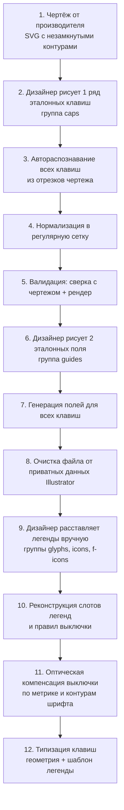
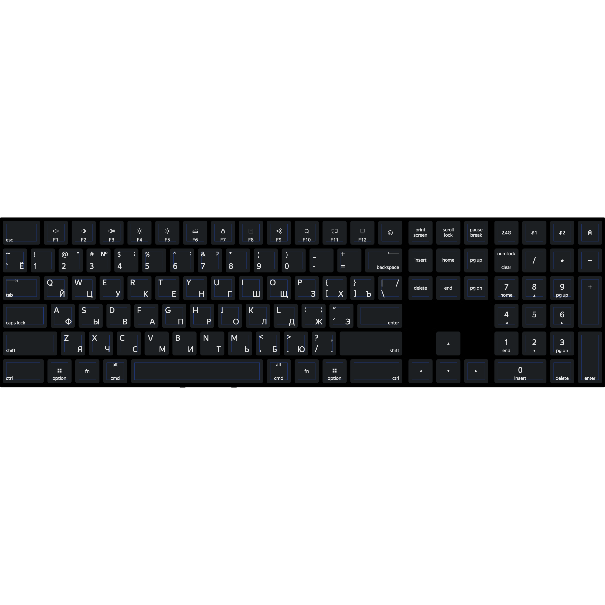
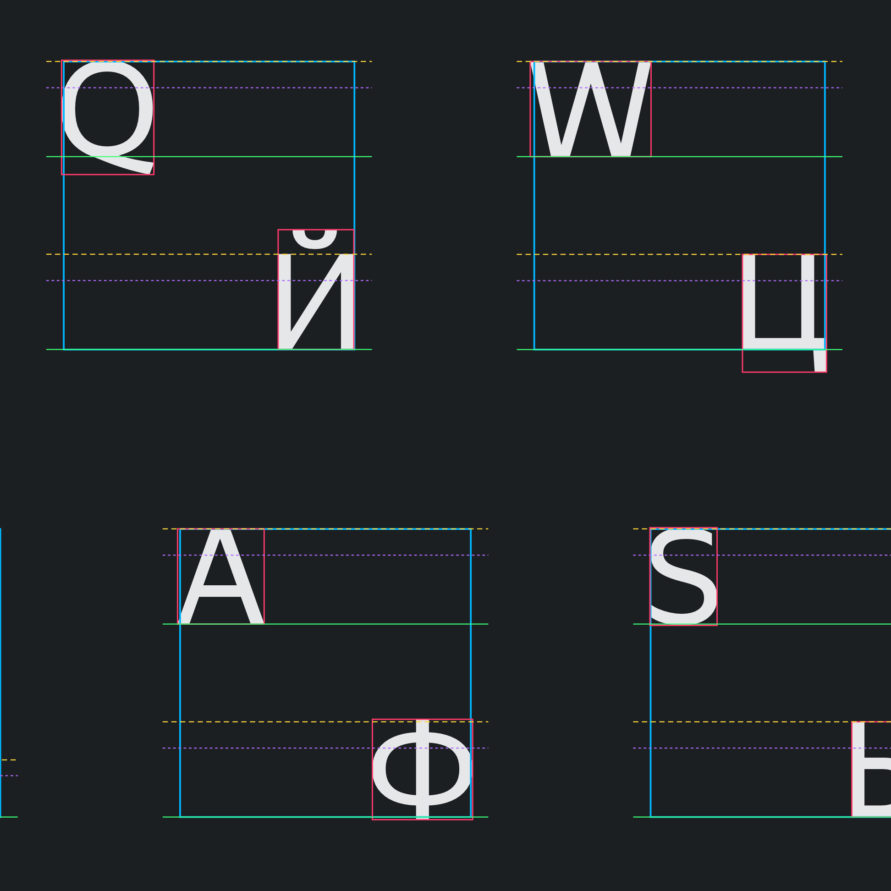
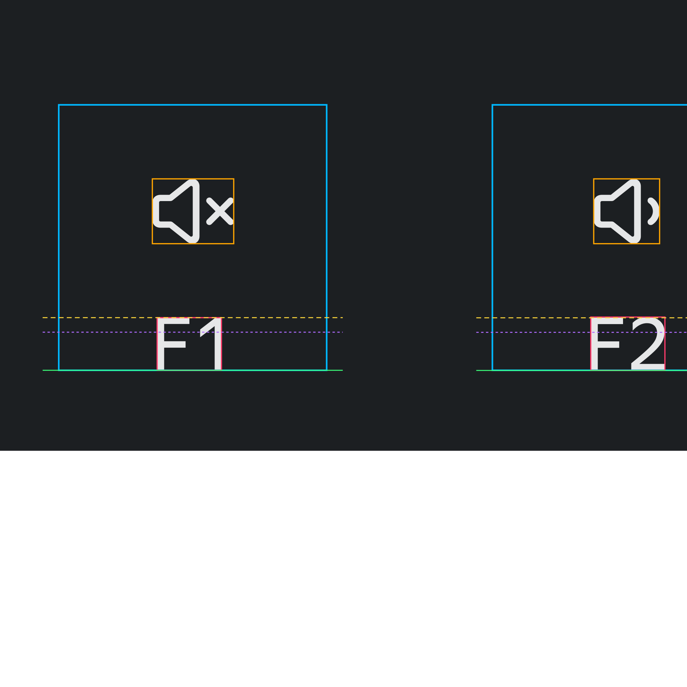
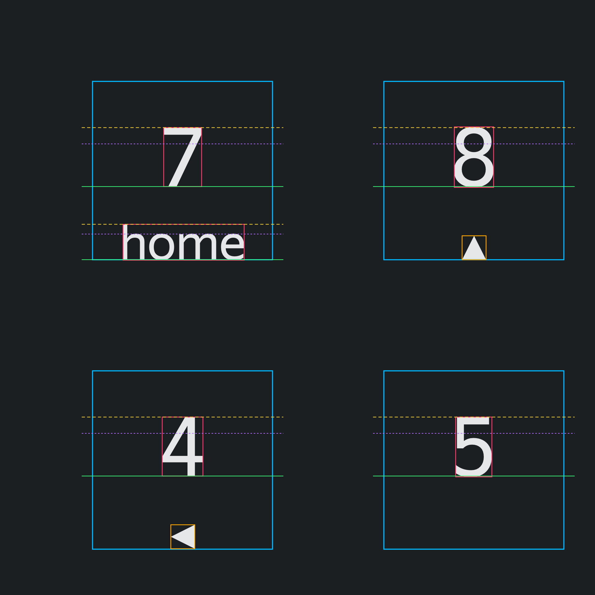
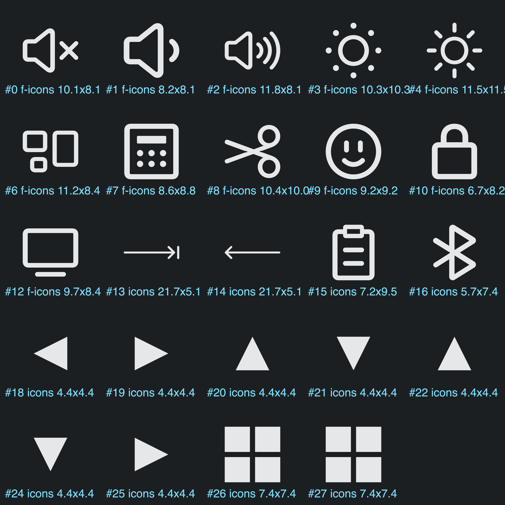

# Пайплайн вёрстки раскладки клавиатуры из чертежа

Документ фиксирует ручной процесс, который сейчас выполняется заново для каждой новой
клавиатуры, и служит спецификацией для будущего браузерного инструмента-генератора.
Все числовые значения приведены на примере проекта **LCAKB23** (`reference/keyboards/Work_2_L.svg`) — 110 клавиш,
6 рядов, полноразмерная раскладка с навигационным блоком и нампадом.

Единица измерения везде — пользовательская единица SVG (`px` в терминах Illustrator).
Значения приводятся с 7 знаками после запятой, потому что именно с такой точностью
Illustrator экспортирует координаты, и накопленная погрешность в 0.02 уже заметна при сверке.

---

## 1. Обзор



Роли: этапы 2, 6 и 9 — ручные, выполняет дизайнер в Illustrator. Этапы 3, 4, 5, 7, 8, 10, 11, 12 —
автоматизируемые, это и есть предмет будущего инструмента.

Ключевая идея первой половины пайплайна: **чертёж не парсится как набор фигур, он парсится как
облако отрезков, из которого геометрия клавиш восстанавливается статистически**. Эталонные клавиши
от дизайнера нужны не для того, чтобы их копировать, а для калибровки констант распознавания.

Ключевая идея второй половины: **охранное поле — это не «безопасная зона», а система координат для
легенд**. Каждый знак и каждая иконка привязаны к одному из слотов поля, а вся ручная работа
дизайнера сводится к двум вещам — выбору слота (алгоритмизируется полностью) и оптической
компенсации выключки (алгоритмизируется с точностью выше собственной повторяемости руки, см. § 10).



---

## 2. Этап 1. Входные данные — чертёж

Чертёж приходит как SVG, экспортированный из CAD или Illustrator. Его особенность, из-за
которой нельзя просто взять готовые фигуры: **все контуры разомкнуты**.

Что лежит внутри группы `blueprint` в LCAKB23:

| Тип элемента | Количество | Что это |
|---|---|---|
| `<line>` горизонтальные | 1658 | прямые участки верхних и нижних кромок клавиш, кромки платы |
| `<line>` вертикальные | 1388 | прямые участки боковых кромок |
| `<line>` диагональные | 884 | выноски, размерные линии, штриховка — **мусор для распознавания** |
| `<path>` | ~1740 | дуги скруглений углов, крепёжные отверстия, мелкая разметка |

Итого 5667 элементов на 110 клавиш. Каждая клавиша нарисована как скруглённый прямоугольник,
разбитый на 4 прямых отрезка и 4 дуги, причём **дуги не соединены с отрезками** — между ними
микрозазоры. Поэтому обычный «выделить и замкнуть» не работает.

Дополнительная сложность: у каждой клавиши **три вложенных контура** — внешний габарит и две
линии фаски, отстоящие внутрь на 0.4937 и 1.0502. Их обязательно нужно отфильтровать, иначе на
каждую клавишу получится по три прямоугольника.

```
y=5.9178  x=[8.4824 .. 73.4480]  ← внешний контур,   пролёт 64.9656
y=6.4115  x=[8.9796 .. 72.9508]  ← первая фаска,     пролёт 63.9712
y=6.9680  x=[8.9796 .. 72.9508]  ← вторая фаска,     пролёт 63.9712
```

---

## 3. Этап 2. Эталонные клавиши от дизайнера

Дизайнер вручную обводит один ряд (в LCAKB23 — верхний, 21 клавиша) простыми
`<rect>` со скруглением в группе `caps`:

```xml
<g id="caps">
  <rect class="st1" x="5.1013862" y="5.9145576" width="71.7216187" height="46.1885376"
        rx="3.3448819" ry="3.3448819"/>
  <rect class="st1" x="84.1898566" y="5.9145576" width="46.4941102" height="46.1885376"
        rx="3.3448819" ry="3.3448819"/>
  ...
</g>
```

Из этого ряда извлекается вся калибровка:

| Константа | Как получена | Значение в LCAKB23 |
|---|---|---|
| Радиус скругления `R` | атрибут `rx` эталона | 3.3448819 |
| Высота клавиши `H1` | `height` эталона | 46.1885376 |
| Ширина 1U `W` | `width` любой обычной клавиши | 46.4941102 |
| Шаг колонки `P` | разница `x` двух соседних 1U | 53.8609619 |
| Зазор `G` | `P − W` | 7.3668517 |
| Зазор между блоками | разница `x` через границу блока минус `W` | 11.8824311 |
| Начало главного блока | `x` первой клавиши | 5.1013862 |

Важно, что дизайнер сам **идеализирует** сетку: он выставляет клавиши строго через `P`, хотя в
чертеже шаг «плавает» на ±0.006. Это осознанное решение, и вся дальнейшая генерация обязана его
повторять, иначе колонки новых рядов разъедутся с эталонным рядом.

Требования к эталону: минимум один полный ряд, обязательно включающий и обычную клавишу 1U, и
хотя бы одну нестандартной ширины (в LCAKB23 это Esc, 71.7216187). Одной клавиши недостаточно —
без второй не вычислить шаг колонки.

---

## 4. Этап 3. Автораспознавание клавиш

Алгоритм восстанавливает габаритные прямоугольники всех клавиш из облака отрезков.

### 4.1. Подготовка

1. Взять **только** содержимое группы `blueprint`. Группу `caps` исключить, иначе эталонные
   клавиши попадут в выборку.
2. Распарсить все `<line>`, разложить на три корзины:
   - горизонтальные — `|y1 − y2| < 1e-6`, хранить как `(y, xmin, xmax)`;
   - вертикальные — `|x1 − x2| < 1e-6`, хранить как `(x, ymin, ymax)`;
   - диагональные — **отбросить**.
3. `<path>` не парсить вообще. Дуги скруглений не нужны: габарит восстанавливается из прямых
   участков и калиброванного радиуса.

### 4.2. Калибровка отступа скругления `d`

Прямой участок верхней кромки начинается не в углу габарита, а на расстоянии радиуса от него.
Этот отступ `d` калибруется по эталонной клавише:

```
d = среднее( segment.xmin − ref.x , (ref.x + ref.w) − segment.xmax )
```

В LCAKB23: `8.4824 − 5.1014 = 3.3810` и `76.8230 − 73.4480 = 3.3750`, отсюда **d = 3.3778**.

Отдельно отмечу: `d` не равен радиусу `R = 3.3448819`, который использует дизайнер. Расхождение
0.033 — следствие того, что дуги в чертеже аппроксимированы и слегка несимметричны по осям
(по вертикали отступ 3.3556, по горизонтали 3.3778). `d` используется только для распознавания,
`R` — только для вывода. Смешивать их нельзя.

### 4.3. Поиск пар кромок

Верхняя и нижняя кромки одного скруглённого прямоугольника имеют **идентичный пролёт по X**.
Это и есть основной признак:

1. Сгруппировать горизонтальные отрезки по ключу `(round(xmin, 1), round(xmax, 1))`.
   Округление до 0.1 гасит шум чертежа, но не склеивает разные клавиши: минимальный шаг
   между колонками 53.86.
2. Внутри группы перебрать все пары отрезков и оставить те, у которых расстояние по Y совпадает
   с одной из **допустимых высот клавиш** — `H1 = 46.188` или `H2 = 99.70`, допуск ±1.0.
3. Отбросить пары с пролётом по X меньше 20 — это размерные засечки и метки фасок.
4. Габарит-кандидат: `(xmin − d, y_top, (xmax + d) − (xmin − d), y_bottom − y_top)`.

Допустимые высоты берутся из эталона: `H1` — напрямую, `H2 = H1 + rowPitch` для клавиш на два
ряда. Если инструмент не знает заранее про клавиши двойной высоты, на этом шаге можно принимать
любое расстояние и кластеризовать результаты по высоте уже после верификации.

### 4.4. Верификация боковыми кромками

Кандидат подтверждается, только если существуют **оба** вертикальных отрезка:

```
есть вертикаль на x ≈ (xmin − d)  с допуском 0.25, покрывающая y от y_top + d до y_bottom − d
есть вертикаль на x ≈ (xmax + d)  с теми же условиями
```

Допуск по Y — 2.0 в каждую сторону (вертикали часто разбиты на куски метками фасок). Этот шаг
отсеивает ложные пары, возникающие из совпадений пролётов у платы и разметки.

### 4.5. Снятие вложенности

Из трёх вложенных контуров нужен только внешний:

1. Отсортировать подтверждённых кандидатов по площади **по убыванию**.
2. Идти по списку и жадно оставлять кандидата, только если он не пересекается ни с одним из уже
   оставленных (допуск на касание 0.5).

Так как внешний контур больше по площади, он попадает в результат первым и «съедает» свои две
фаски. В LCAKB23 из 137 кандидатов остаётся ровно 110 клавиш.

### 4.6. Результат

Массив габаритов с точностью до шума чертежа. Пример по LCAKB23: 21 + 21 + 21 + 16 + 17 + 14 = 110,
из них 108 обычной высоты и 2 двойной (`+` и `Enter` на нампаде).

Отдельно подчеркну, почему клавиши двойной высоты требуют внимания: в своём ряду они выглядят как
**отсутствующая** клавиша, и при визуальной обводке их легко пропустить. Признак — ряд, в котором
клавиш меньше, чем в соседних, при том что колонка занята в предыдущем ряду.

---

## 5. Этап 4. Нормализация в сетку

Распознанные габариты нельзя выводить как есть: шаг колонок в чертеже гуляет между 53.855255 и
53.861206, и клавиши визуально разъедутся с эталонным рядом на 0.017. Поэтому геометрия
пересобирается на идеальной сетке.

### 5.1. Константы

```
P   = 53.8609619    шаг колонки (1U)
W   = 46.4941102    ширина 1U
G   = 7.3668517     зазор между клавишами (P − W)
RP  = 53.5120668    шаг ряда
H1  = 46.1885376    высота клавиши
H2  = 99.7006044    высота клавиши на два ряда (H1 + RP)
R   = 3.3448819     радиус скругления
```

Шаг ряда считается как `(верх последнего ряда − верх первого ряда) / (число рядов − 1)`.
В LCAKB23 это `(273.4781 − 5.9178) / 5 = 53.5120668`.

Обратите внимание: **шаг ряда меньше шага колонки** (53.512 против 53.861), то есть вертикальный
зазор между клавишами 7.3235 против горизонтального 7.3669. Это свойство конкретной клавиатуры,
а не ошибка — инструмент не должен предполагать изотропную сетку.

### 5.2. Начала блоков

```
main   x = 5.1013862
nav    x = 788.8979407
numpad x = 954.9964059
RM     = 777.0155096   правый край главного блока
```

`RM` берётся как правый край последней клавиши главного блока в эталонном ряду.

### 5.3. Правило раскладки ряда

Ряд задаётся списком ширин, клавиши выставляются слева направо:

```
x[0]   = начало блока
x[i+1] = x[i] + w[i] + G
```

Ширины бывают трёх видов:

- `1U` — берётся `W`;
- **явная** — измеренное значение для нестандартной клавиши;
- **замыкающая** (`close`) — вычисляется как `RM − x`, чтобы ряд закончился ровно на правом крае
  блока.

Замыкающая ширина нужна из-за накопления погрешности: при чейнинге через идеальный `P` правый край
уходит от измеренного на 0.006…0.02. Подгонка последней широкой клавиши в ряду (Backspace, Enter,
правый Shift, правый Ctrl) убирает это расхождение и делает правый край блока идеально ровным во
всех рядах. Цена — отклонение ширины одной клавиши от чертежа на 0.02, то есть 0.002% от ширины
макета.

### 5.4. Спецправило для пробела

Пробел — самая широкая клавиша, и после него идут ещё клавиши, которые в чертеже стоят **ровно в
колонках первого ряда**. Поэтому его ширина не измеряется, а вычисляется так, чтобы следующая
клавиша попала в колонку сетки:

```
SPACE = x_следующей_колонки − G − x_пробела
      = 515.0775518 − 7.3668517 − 252.8593966
      = 254.8513035
```

Приятный побочный эффект: при таком пробеле замыкающая ширина правого Ctrl получается ровно
`2U = 100.3550721`, что подтверждает корректность правила.

### 5.5. Раскладка LCAKB23

Блоки: `main` — основной, `nav` — навигация (3 колонки), `num` — нампад (4 колонки).
`·` означает пропуск колонки.

| Ряд | main | nav | num |
|---|---|---|---|
| 1 | `71.7216187` + 13×1U | 3×1U | 4×1U |
| 2 | 13×1U + `close`(71.7216187) | 3×1U | 4×1U |
| 3 | `71.7216187` + 13×1U | 3×1U | 3×1U + **1U×2 ряда** |
| 4 | `85.043564` + 11×1U + `close`(87.0331268) | — | 3×1U + `·` |
| 5 | `104.887070` + 10×1U + `close`(121.0505827) | `·` 1U `·` | 3×1U + **1U×2 ряда** |
| 6 | `78.808273` + 3×1U + `SPACE` + 3×1U + `close`(100.3550721) | 3×1U | `2U` + `·` + 1U |

Полный набор ширин:

| Ширина | Кол-во | Клавиши |
|---|---|---|
| 46.4941102 | 99 | обычные 1U |
| 71.7216187 | 3 | Esc, Backspace, Tab |
| 78.8082730 | 1 | левый Ctrl |
| 85.0435640 | 1 | Caps Lock |
| 87.0331268 | 1 | Enter |
| 100.3550721 | 2 | правый Ctrl, «0» нампада (2U) |
| 104.8870700 | 1 | левый Shift |
| 121.0505827 | 1 | правый Shift |
| 254.8513035 | 1 | пробел |

Ширины не кратны 1U: 71.72 — это 1.468U, 85.04 — 1.716U, 104.89 — 2.084U. То есть **нельзя
опираться на стандартные размеры MX-раскладок**, каждая клавиатура задаёт свои.

---

## 6. Этап 5. Валидация

Три независимые проверки, все обязательны.

**1. Совпадение количества.** Число сгенерированных клавиш должно совпасть с числом распознанных.
Расхождение означает либо пропущенную клавишу в описании ряда, либо ложное срабатывание
распознавания.

**2. Покоординатная сверка.** Для каждой сгенерированной клавиши найти ближайшую распознанную и
посчитать максимальное отклонение по `x`, `y`, `width`, `height`. Порог — 0.05. В LCAKB23 худшее
отклонение **0.0196**.

**3. Побитовое воспроизведение эталона.** Генератор, запущенный на эталонном ряду, должен выдать
строки, **посимвольно совпадающие** с тем, что нарисовал дизайнер. Это самая сильная проверка: она
подтверждает, что константы сетки восстановлены верно, а не подогнаны. В LCAKB23 все 21 строка
совпали.

**4. Визуальный контроль.** Рендер в PNG в двух режимах:
- полупрозрачная заливка клавиш поверх чертежа — видно пропуски и грубые сдвиги;
- клавиши без заливки, только тонкая обводка контрастным цветом — при точном совпадении обводка
  полностью прячется под линиями чертежа, любое расхождение сразу бросается в глаза.

На macOS для рендера без установки зависимостей годится `qlmanage -t -s 2400 -o . file.svg`.

---

## 7. Этап 6–7. Guides — внутренние поля

Поля — это внутренняя область клавиши под гравировку/печать. Дизайнер рисует **два эталона** в
новой группе `guides` и сообщает отступ (в LCAKB23 — **6.6085** от края поля до края клавиши по
всем четырём сторонам).

### 7.1. Разбор эталона

Illustrator может записать прямоугольник с трансформацией:

```xml
<rect class="st2" x="12.2089013" y="13.0225419" width="58.5046083" height="32.9715322"
      transform="translate(82.9224108 59.0166159) rotate(-180)"/>
```

`translate(tx ty) rotate(-180)` отображает точку в `(tx − px, ty − py)`, поэтому фактический
габарит:

```
x' = tx − x − w
y' = ty − y − h
```

Если `x' == x` и `y' == y`, трансформация — **пустышка**: поворот на 180° вокруг собственного
центра. Так и было в LCAKB23. Инструмент обязан её разворачивать, иначе поля «уедут» в другой
конец макета.

### 7.2. Проверка отступа

Прежде чем генерировать, отступ надо проверить по эталону со всех четырёх сторон:

```
left   = guide.x − cap.x
top    = guide.y − cap.y
right  = (cap.x + cap.w) − (guide.x + guide.w)
bottom = (cap.y + cap.h) − (guide.y + guide.h)
```

Все четыре должны совпасть с заявленным отступом. В LCAKB23 максимальное отклонение по 110 парам —
**0.0004**, это только округление координат при экспорте.

### 7.3. Генерация

```
field = ( cap.x + I , cap.y + I , cap.w − 2I , cap.h − 2I ),  I = 6.6085
```

Три правила, которые важно соблюсти:

1. Поле считается **от фактической геометрии своей клавиши**, а не от сетки. Тогда оно всегда
   точно центрировано, даже если клавиша после сохранения из Illustrator сместилась на доли
   единицы.
2. Поля рисуются **без скругления** — простыми `<rect>` без `rx`/`ry`. Так их нарисовал дизайнер.
3. Клавиши двойной высоты дают вытянутое поле: `99.7006044 − 13.217 = 86.4836044`.

Набор ширин полей для LCAKB23: 33.277 (1U), 58.505, 65.591, 71.827, 73.816, 87.138, 91.670,
107.834, 241.634.

---

## 8. Этап 9. Легенды: инвентарь и типографика

Ручной этап, аналог этапов 2 и 6: дизайнер добавляет три группы и расставляет в них всё «на глаз».
Задача автоматизации — не воспроизвести эти координаты, а **вывести из них правила** и потом
генерировать координаты заново из текста и набора иконок.

### 8.1. Инвентарь групп

| Группа | Элементов | Что внутри |
|---|---|---|
| `glyphs` | 173 `<text>` → 176 логических строк | латиница, кириллица, цифры, знаки препинания, слова-подписи |
| `icons` | 15 фигур | пиктограммы на обычных клавишах: стрелки, tab/backspace, option, win |
| `f-icons` | 13 фигур | пиктограммы функций в F-ряду и на дополнительных клавишах |

Покрытие: из 110 клавиш 103 несут текст, 28 несут иконку, **109 несут хотя бы что-то**, одна
(пробел) пустая. Все 176 строк и все 28 иконок однозначно привязались к клавишам по попаданию
центра габарита в габарит клавиши — ни одного нераспознанного элемента.

### 8.2. Правило склейки строк

`<text>` в экспорте Illustrator **не совпадает** с логической надписью. Многострочная подпись
(`print` + `screen`) — это один `<text>` с двумя `<tspan>`; надпись со сложным кернингом (`2.4G`)
— один `<text>`, разбитый на несколько `<tspan>` с индивидуальным `letter-spacing`.

Правило: **`<tspan>` склеиваются в одну логическую строку, если у них одинаковый `y`**; разный `y`
— это разные строки. Отсюда 173 → 176. Без этого правила `2.4G` распадается на `2`, `.`, `4G`
и каждый обломок начинает выглядеть как отдельный глиф в отдельном слоте.

### 8.3. Кегли

Все надписи набраны `YS Text Regular` (UPM 1000, capHeight 717, xHeight 519, asc 928, desc −244).
Использовано ровно четыре кегля:

| Кегль, px | Строк | Назначение | capHeight, px | xHeight, px |
|---|---|---|---|---|
| 15.1998701 | 103 | основной знак клавиши | 10.8983 | 7.8887 |
| 13.1732197 | 12 | цифры нампада | 9.4452 | 6.8369 |
| 12.0744696 | 8 | второй знак на клавишах-«близнецах» | 8.6574 | 6.2666 |
| 9.1199198 | 53 | слова-подписи, вторые строки | 6.5390 | 4.7332 |

Кегли не произвольны. Три из четырёх — целые пункты, умноженные на общий коэффициент
**1.0133245**: 9 × 1.0133245 = 9.1199198, 13 × 1.0133245 = 13.1732197, 15 × 1.0133245 = 15.1998701
(совпадение до 7-го знака). Их отношения тоже целые: `word / glyph = 0.600000 = 3/5`,
`numpad / glyph = 0.866667 = 13/15`.

Исключение — 12.0744696: он даёт 11.9157 pt, не целое, и составляет 0.79438 от основного кегля.
Похоже, эти 8 строк были набраны основным кеглем и потом отмасштабированы вручную. Для инструмента
это значит, что **кегль второго знака надо задать явно** (например, 0.8 от основного), а не пытаться
вывести из макета.

Важно: коэффициент 1.0133245 относится **только к тексту** и геометрию клавиш не объясняет. У
геометрии своя система — миллиметры при 72 dpi. Масштаб подтверждён независимым замером по точному
чертежу: **10000 px = 3527.778 мм**, то есть 1 px = 0.3527778 мм = 25.4/72 мм ровно. Контроль по
пробелу: 254.8513 px × 0.3527778 = 89.9059 мм против измеренных 89.906.

| Величина | px | мм |
|---|---|---|
| шаг по X | 53.8610 | **19.0010** — стандартный шаг клавиатуры 19 мм |
| ширина 1U | 46.4941 | **16.4021** |
| зазор по X | 7.3669 | **2.5989** |
| радиус скругления | 3.3449 | **1.1800** |
| шаг по Y | 53.5120 | 18.8778 |
| высота клавиши | 46.1885 | 16.2943 |
| инсет поля | 6.6085 | 2.3313 |

По X всё круглое: 19 / 16.4 / 2.6 / 1.18 мм. По Y — нет, и причина видна из отношений:
`H/W = 0.99343`, `Py/Px = 0.99352`. Это одно и то же число, то есть **макет сжат по вертикали
на 0.648 %** относительно исходных мм. Клавиши в файле не квадратные: 16.40 × 16.29 мм. Сжатие
надо либо воспроизводить (если так задумано производителем), либо снимать при импорте — но
осознанно, а не случайно.

Трекинг задаётся отдельными классами и накладывается поверх кегля:

| Класс | letter-spacing | Где |
|---|---|---|
| `st13` | −0.030036em | плотные слова |
| `st6`, `st12` | −0.020024em, −0.0199705em | слова средней плотности |
| `st8` | −0.0099585em | лёгкое поджатие |
| `st10`, `st11`, `st14` | +0.020024em, +0.0199705em | разрядка мелких подписей |

**Важный артефакт**: во всех текстовых классах Illustrator пишет `font-variation-settings: ';`
— незакрытая строковая константа, невалидное CSS-значение. Это остаток настроек вариативной оси
(см. § 12 про вариативные шрифты). Браузеры молча игнорируют такое объявление, но собственный
парсер обязан не падать на нём.

---

## 9. Этап 10. Слоты охранного поля и правила выключки

Главный вывод анализа: **охранное поле — это не «безопасная зона», а система координат.** Для
поля 1U размером 33.2771 × 32.9715 определены 7 вертикальных и 5 горизонтальных якорей; любой
элемент любой клавиши сидит в пересечении одной пары.

### 9.1. Вертикальные якоря

Обозначения используются в отчётах `analysis/final.py`.

| Код | Правило | n | Медиана невязки | σ |
|---|---|---|---|---|
| `B` | **baseline = низ поля** | 82 | 0.0002 px | 0.076 |
| `T` | **capline = верх поля**, т.е. baseline = верх поля + capHeight·кегль | 50 | −0.0113 px | 0.199 |
| `M` | **x-высота центрирована**: baseline = центр поля + xHeight·кегль/2 | 9 | 0.21 px | 0.23 |
| `U` | ярус над `B`: baseline = низ поля − 13.5279 | 18 | 13.5277 | разброс 0.71 |
| `F` | центр габарита иконки = середина свободной зоны над подписью | 12 | 0.0030 px | 0.228 |
| `t`/`b` | верхняя/нижняя половина без точной привязки | — | — | — |

Ключевые следствия:

1. **Выносные элементы не участвуют в выключке.** Вертикаль считается не по чернильному габариту,
   а по типографскому cap-боксу `[baseline − capHeight·кегль, baseline]`. Иначе `Ё` и `Й` уехали бы
   вниз относительно `Е` и `И`, а `,` и `_` — вообще за пределы поля. Медиана невязки 0.0002 px по
   82 точкам — это не «примерно», это буквально попадание в ноль.
2. **`U` — не отдельное правило, а тот же `B`, сдвинутый на строку.** Измеренный интерлиньяж пары
   «кегль 15.2 сверху / кегль 9.12 снизу» равен 13.5156 (разброс 0.04), а смещение яруса `U` от низа
   поля — 13.5277. Это одно и то же число: **интерлиньяж = 13.52**, и двухстрочная композиция
   строится как «нижняя строка на низ поля, верхняя на 13.52 выше».
3. **`M` работает по x-высоте, а не по cap-height и не по чернильному габариту.** Для строчных
   слов (`fn`, `delete`, `home`) визуальный центр — середина x-высоты; проверка гипотез даёт для
   `xbox.mid = guide.mid` медиану невязки 0.000 px против 0.011 для cap-бокса и 0.066 для ink-бокса.
4. **Символы — исключение.** Для не-алфавитных знаков (`~`, `{`, `˝`, `|`) cap-бокс бессмыслен, они
   выключаются по чистому чернильному габариту: `ink.top = guide.top`, 15 точек, медиана 0.049 px.

### 9.2. Горизонтальные якоря

| Код | Правило | n | Медиана невязки |
|---|---|---|---|
| `C` | **центр по метрике: bx + advanceWidth/2 = центр поля** | 47 | 0.005 px |
| `L` | `ink.left = левый край поля` + оптическая компенсация | 65 | 0.190 px |
| `R` | `ink.right = правый край поля` + оптическая компенсация | 44 | 0.101 px |
| `l`/`r` | половина без точной привязки | — | — |

Здесь принципиальная асимметрия, которую нельзя пропустить:

* **Центрирование — механическое, по перу.** Побеждает гипотеза «середина суммарного advance
  совпадает с центром поля»: медиана 0.005 px, максимум 0.042 px по 47 точкам. Не по чернильному
  габариту (медиана 0.011, но σ хуже), не по ink-центру. То есть в центре дизайнер полагается на
  полуапроши шрифта и **ничего не компенсирует руками** — они симметричны и гасят друг друга.
* **Прижатие к краю — оптическое.** Медианы 0.19 и 0.10 px — это **не погрешность, это и есть
  оптическая компенсация**. Разброс от −0.60 до +0.77 px (медиана +0.08) при кегле 15.2. Именно
  этот столбец цифр дизайнер и набивает вручную; ему посвящён § 10.

### 9.3. Иконки

Иконки компенсации не требуют вообще — это самый простой случай во всём макете.

* **Одиночная иконка центрируется геометрически** по габариту в поле: измеренное отклонение
  Δx = +0.042 px, Δy = +0.003 px, одинаковое для всех шести таких клавиш, то есть это глобальная
  константа округления, а не разнобой.
* **По горизонтали 82 % всех 28 иконок центрированы точнее 0.1 px.**
* Иконка с подписью (F-ряд, `option`) ставится в слот `F`: центр габарита = середина свободной
  зоны между верхом поля и capline подписи. Медиана 0.003 px по 12 клавишам.
* Угловые иконки (`tab`, `backspace`) прижимаются габаритом к углу поля.

Размеры иконок — это семейство, а не произвол:

| Габарит | n | Что это |
|---|---|---|
| 4.431 × 4.431 | 8 | стрелки курсора и нампада, строгий квадрат |
| 7.430 × 7.431 | 2 | win/«четыре квадрата», квадрат |
| 21.668 × 5.08…5.10 | 2 | длинные стрелки `tab` / `backspace` |
| 8.05 по высоте | 3 | группа f-иконок с общей высотой |
| 9.23…11.77 | 11 | остальные f-иконки, вписаны в ~10–11 px |






---

## 10. Этап 11. Оптическая компенсация

Постановка задачи в терминах дизайнера: у каждой буквы свои полуапроши, и круглые `O C Э` при
прижатии к краю поля надо выпускать за край сильнее, чем прямоугольные `H I Ш`. Делается на глаз.
Ниже — как это считать.

### 10.1. Почему полуапрошей недостаточно

Первое, что хочется сделать — взять `lsb`/`rsb` из шрифта и вычесть. Это работает плохо: модель
`компенсация = k · (полуапрош_штамба − полуапрош_знака)` даёт **R² = 0.32, RMSE = 0.209 px**
(`analysis/fit.py`). Причина в том, что полуапрош — одно число на весь знак, а глаз реагирует на
**площадь просвета вдоль всей высоты знака**. У `Т` и `Г` полуапрош такой же, как у `H`, а просвет
под перекладиной огромный. Одномерная метрика этого не видит.

### 10.2. Что действительно определяет компенсацию

Проверяемая гипотеза: **компенсация пропорциональна доле высоты знака, на которой контур не
касается своей крайней вертикали, и глубине этого отступления.** Реализация — `analysis/optics.py`:

1. Контур глифа разворачивается в полилинию (`DecomposingRecordingPen`, обязательно
   декомпозирующий — иначе составные кириллические знаки дают пустой контур, см. § 15).
2. Берётся полоса измерения = пересечение чернильного габарита с `[0, capHeight]`.
3. Полоса режется на сканлайны; для каждого фиксируется крайняя левая и крайняя правая точка ink.
4. От профиля считаются два безразмерных признака:
   * `noncontact` — доля сканлайнов, где контур отступил от крайней вертикали больше чем на `eps`;
   * `recess` — средняя глубина отступления, обрезанная сверху окном `w` (насыщение: просвет глубже
     `w` глазом уже не различается).

Итоговая модель (МНК без свободного члена, `analysis/model.py`, `eps = 32`, `w = 300` em-units):

```
компенсация[em-units] = 41.34 · noncontact − 42.60 · recess
компенсация[px]       = компенсация[em-units] · кегль / 1000
```

### 10.3. Точность

| Выборка | n | R² | RMSE | max &#124;Δ&#124; |
|---|---|---|---|---|
| буквы и цифры | 69 | **0.753** | **0.098 px** | 0.286 px |
| знаки препинания | 36 | 0.176 | 0.305 px | 0.614 px |
| всё вместе | 105 | 0.400 | 0.195 px | 0.625 px |

Чтобы понять, хорошо это или плохо, нужна точность самой руки. Её даёт контрольная группа: знаки
с **плоским вертикальным штамбом** на прижимаемой стороне (`H I K L M N P R B D E F`, `И Й Л М Н П
Ч Ш Ы Я`, `-`, `=`, `[`, `|`) компенсации требовать не должны в принципе. Факт по 22 таким буквам и
цифрам: среднее **−0.67 em-units (−0.010 px)**, σ = 3.11 em-units = **0.047 px**.

Отсюда два вывода:

1. **Правило «плоский штамб → ink точно по краю поля» подтверждено**: систематического смещения
   нет (−0.010 px), а σ 0.047 px — это дрожание руки, а не замысел.
2. Для круглых и открытых знаков разброс совсем другой: среднее **+9.58 em-units (+0.146 px)**,
   σ = 15.6 em-units. Компенсация реальна и велика — до 0.77 px, то есть **12 % ширины буквы**.
   Модель воспроизводит её с RMSE 0.098 px, что **лежит внутри полосы неопределённости самой
   ручной работы** и вдвое лучше наивной модели полуапрошей.

Порядок величин на характерных знаках (em-units, 1000 = кегль):

| Знак | Факт | Модель | Δ, px |
|---|---|---|---|
| `Щ` | +33.5 | +25.2 | +0.127 |
| `W` | +30.2 | +21.7 | +0.130 |
| `Х` | +19.8 | +19.0 | +0.012 |
| `X` | +19.4 | +19.0 | +0.007 |
| `A` | +19.2 | +18.0 | +0.018 |
| `H` | +0.9 | 0.0 | +0.014 |
| `L` | +0.0 | 0.0 | +0.001 |
| `Ч` | −0.0 | 0.0 | −0.000 |
| `Т` | −10.1 | +8.7 | −0.286 |

Знак компенсации осмыслен: `Щ W X A` — расходящиеся или многоштамбовые, их выпускают за край;
`H L Ч` — плоские, стоят ровно по краю. Худший остаток — `Т` при прижатии справа: модель хочет
выпустить её наружу из-за просвета под перекладиной, а дизайнер, наоборот, задвинул внутрь.
Это содержательное расхождение, а не шум: у `Т` просвет **под** перекладиной, но сама перекладина
доходит до края, и глаз ориентируется на неё. Признак «где находится просвет по высоте» в модели
отсутствует — это первый кандидат на доработку.

### 10.4. Что делать со знаками препинания

R² = 0.176 — модель на них не работает, и это ожидаемо: у `~`, `˝`, `/`, `№` нет ни cap-бокса, ни
штамба, а компенсация определяется наклоном и высотой расположения пятна. Рекомендация для
инструмента: **не пытаться считать их формулой, а держать таблицу компенсаций на ~40 знаков**
(один раз выверяется глазом на конкретной гарнитуре и переиспользуется). Формула остаётся для
букв и цифр, где знаков много и таблица непрактична.

### 10.5. Алгоритм для инструмента

```
выключка_по_левому_краю(знак, кегль, поле):
    если знак — буква или цифра:
        c = (41.34 · noncontact − 42.60 · recess) · кегль / 1000
    иначе:
        c = ТАБЛИЦА[знак] · кегль / 1000
    x_пера = поле.left − ink_left(знак, кегль) − c
```

`noncontact` и `recess` зависят только от гарнитуры, поэтому считаются один раз при загрузке
шрифта и кладутся в кэш по кодовой точке. При смене гарнитуры коэффициенты 41.34 / −42.60
формально надо перепроверять, но они безразмерные и должны переноситься между шрифтами одного
класса (гротеск нормальной плотности).

---

## 11. Этап 12. Типизация клавиш

Типизация нужна двухслойная, потому что в раскладке независимо варьируются две вещи: **геометрия
клавиши** и **композиция легенды на ней**. Одна и та же геометрия 1U несёт и `alpha-dual`, и
`icon-center`; один и тот же шаблон `word-outer` встречается на 1.47U и на 2.38U.

### 11.1. Слой 1: геометрия

Из § 5: `W = 46.4941`, `H = 46.1885`, шаг `53.861 × 53.512`, зазоры `7.367 / 7.323`, инсет поля
`6.6085`, 6 рядов, 110 клавиш.

Ширины в единицах U (U = 1 клавиша + 1 зазор):

| U | n | Клавиши |
|---|---|---|
| 1.0000 | 99 | все алфавитно-цифровые, F-ряд, nav, нампад |
| 1.4684 | 3 | `esc`, `tab`, `backspace` |
| 1.6000 | 1 | `ctrl` левый |
| 1.7157 | 1 | `caps lock` |
| 1.7527 | 1 | `enter` |
| 2.0000 | 2 | `0` нампада, `ctrl` правый |
| 2.0841 | 1 | `shift` левый |
| 2.3842 | 1 | `shift` правый |
| 4.8684 | 1 | пробел |
| высота 2.0000 | 2 | `+` и `enter` нампада |

Существенный вывод: **ширины не кратны U.** 1.4684, 1.7157, 2.0841 — это не «1.5U / 1.75U / 2U»,
а результат выравнивания краёв блока: сумма ширин ряда должна совпасть с шириной блока. Поэтому
в модели данных ширина хранится в абсолютных единицах, а не в U, и **пересчитывается заново при
любом изменении состава ряда**. Хардкод «shift = 2.25U», принятый в MX-раскладках, здесь неверен.

Разбиение на блоки — по разрывам сетки: `main` | зазор 11.88 (=1.61·Gx) | `nav` | зазор 11.88 |
`numpad`. Порог «зазор больше 1.5 обычного» отделяет блоки надёжно и не требует ручной разметки.

### 11.2. Слой 2: шаблоны легенды

Шаблон = упорядоченный набор занятых слотов (§ 9) + тип содержимого каждого. 110 клавиш
раскладываются в 17 шаблонов, из которых 15 содержательных и 2 остаточных:

| Шаблон | n | Слоты | Примеры |
|---|---|---|---|
| `alpha-dual` | 26 | `TL`, `BR` | `Q Й`, `W Ц`, `E У` |
| `legend-corners` | 14 | 3–4 угла | `` ~ ` Ё ``, `@ " 2`, `? , / .` |
| `word-center` | 13 | `MC` | `delete`, `home`, `fn`, `2.4G` |
| `fkey-icon+label` | 11 | `FC` + `BC` | `F1`…`F12` |
| `word-outer` | 7 | `BL` или `BR` | `esc`, `caps lock`, `enter`, `shift` |
| `legend-2corners` | 7 | 2 угла | `! 1`, `% 5`, `( 9` |
| `icon-center` | 6 | `MC` иконка | стрелки, win |
| `word-stack` | 5 | `TC` + `BC` | `print screen`, `alt cmd` |
| `word-2line` | 5 | `UC` + `BC` | `7 home`, `0 insert` |
| `numpad-tier` | 4 | `UC` + иконка | `8`, `4`, `6`, `2` |
| `icon+word-stack` | 3 | иконка + `BC` | `F10`, `option` |
| `status-pair` | 2 | `Ml` + `Mr` | индикаторы `1`, `2` |
| `corner-icon+word` | 2 | угловая иконка + слово | `tab`, `backspace` |
| `word-bottom` | 2 | `BC` | `enter`, `delete` нампада |
| `blank` | 1 | — | пробел |
| `other:top-left+bot-center` | 1 | — | `num lock clear` |
| `other:top-center` | 1 | — | `+` нампада |

**Покрытие 108 из 110 клавиш пятнадцатью шаблонами.** Два остатка — честные единичные исключения:
`num lock clear` (двухсоставная подпись с разной вложенностью) и `+` нампада (двойная высота,
подпись в верхней половине).

### 11.3. Как это использовать в инструменте

Клавиша в модели данных описывается тремя независимыми полями:

```
{ geom: "1U" | "1.4684U" | ... ,   // абсолютная ширина, пересчитывается
  tpl:  "alpha-dual",              // шаблон легенды
  data: { TL: "Q", BR: "Й" } }     // содержимое слотов
```

Смена языка раскладки трогает только `data`. Смена форм-фактора (ANSI → ISO) трогает `geom` и
состав ряда. Смена стиля нанесения (например, «кириллица не в правом нижнем углу, а под
латиницей») трогает только `tpl` — один раз для всех 26 клавиш сразу. Именно эта развязка и есть
практический смысл типизации: **при ручной вёрстке любая правка стиля означает 26 ручных
операций, при типизированной — одну.**

Наблюдения, которые стоит зашить в редактор как ограничения:

* Слот `C` (центр) не требует оптической компенсации — по метрике пера, § 9.2.
* Слоты `L`/`R` требуют компенсации по § 10.
* Двухстрочные композиции пользуются единым интерлиньяжем 13.52 (§ 9.1, п. 2).
* Иконка и текст в одной клавише никогда не конкурируют за слот: иконка занимает `F` или `M`,
  текст — `B`.
* Кегль определяется ролью, а не клавишей: 15.2 — знак, 13.17 — цифра нампада, 12.07 — второй
  знак, 9.12 — слово.

---

## 12. Особенности Illustrator при обмене файлами

Самый болезненный блок. На нём в ходе работы потерялись две итерации, поэтому фиксирую подробно.

### 12.1. Preserve Illustrator Editing Capabilities — главная ловушка

При сохранении SVG с включённой галочкой **Preserve Illustrator Editing Capabilities** Illustrator
дописывает в конец файла блок:

```xml
<metadata>
  <i:aipgfRef id="adobe_illustrator_pgf"/>
  <i:aipgf id="adobe_illustrator_pgf" i:pgfEncoding="zstd/base64" i:pgfVersion="24">
    <![CDATA[ ...zstd/base64... ]]>
  </i:aipgf>
</metadata>
```

Это полный снимок документа в приватном формате Illustrator (PGF), в LCAKB23 — **438–456 КБ и
около 5900 строк**. При открытии такого файла **Illustrator читает снимок и полностью игнорирует
SVG-разметку**. Следствие: любая внешняя правка файла для Illustrator невидима, хотя Finder,
браузеры и рендереры показывают её корректно.

Симптом: «я открыл файл и вижу только то, что нарисовал сам».

Лечение — удалить блок:

1. вырезать всё от `<metadata>` до `</metadata>` включительно;
2. удалить ставшее ненужным объявление `xmlns:i="http://ns.adobe.com/AdobeIllustrator/10.0/"`;
3. проверить, что XML остался валидным и группы на месте.

Профилактика: снимать галочку в диалоге **SVG Options** при `File → Save As`. Illustrator
запоминает её состояние между сохранениями, так что достаточно одного раза. Побочная выгода —
файл становится примерно на треть меньше.

Инструменту стоит делать эту очистку автоматически при импорте и предупреждать пользователя.

### 12.2. Сдвиг всей графики при сохранении

Каждое сохранение из Illustrator сдвигает **все** координаты и раздувает `viewBox` на толщину
обводки — Illustrator включает обводку в границы артборда:

```
viewBox до:    0 0 1168.1859572 327.6905654
viewBox после: 0 0 1169.1846855 328.6893243     +0.9987283 по обеим осям
все координаты:                                 +0.4993827
```

Практический вывод: **координаты нельзя переносить между сохранениями**. Перед каждой генерацией
геометрию нужно перечитывать из текущей версии файла. Относительные величины — шаги, ширины,
зазоры, отступы — при этом инвариантны, поэтому константы сетки из раздела 5 остаются в силе,
меняется только начало отсчёта.

### 12.3. Прочие артефакты

| Артефакт | Проявление | Как обрабатывать |
|---|---|---|
| Переименование классов | `caps` был `.st1`, после сохранения стал `.st0`; blueprint наоборот | не хардкодить имена классов, искать элементы по `id` группы |
| Пустые трансформации | `transform="translate(...) rotate(-180)"` вокруг своего центра | разворачивать в габарит (см. 12.1) |
| Перекруглённые координаты | ширина 1U встречается и как 46.4941025, и как 46.4941101 | допуск при сравнении не жёстче 0.001 |
| Перекруглённый радиус | один `rx` превратился в 5 разных: 3.3448486 … 3.3449097 | при выводе подставлять единое каноническое `R` |
| Файл не перечитывается | Illustrator не видит правок на диске | `File → Revert`; **не сохранять** перед этим, иначе старая версия перезапишет файл |
| Добавляется `id="Layer_1"` | у корневого `<svg>` | безвредно |

---

## 13. Структура итогового файла

```xml
<svg viewBox="0 0 1169.1846855 328.6893243">
  <defs><style> .st0 … .st1 … .st2 … </style></defs>

  <g id="caps">      <!-- 110 rect: скруглённые габариты клавиш -->
  <g id="blueprint"> <!-- 5667 элементов исходного чертежа, без заливки, обводка #010101 -->
  <g id="guides">    <!-- 110 rect: внутренние поля, без заливки, обводка #d44698 0.5px -->
  <g id="glyphs">    <!-- 173 text: все надписи, 4 кегля, класс на <text> или <tspan> -->
  <g id="icons">     <!-- 15 фигур: пиктограммы на обычных клавишах -->
  <g id="f-icons">   <!-- 13 фигур: пиктограммы функций F-ряда -->
</svg>
```

Порядок групп задаёт z-order. `caps` идёт первой и лежит **под** чертежом — это удобно, потому что
линии чертежа остаются читаемыми поверх заливки. `guides` и легенды сверху.

Про формы внутри `icons` / `f-icons`: это не только `<path>`. Встречаются `<polygon>` (все стрелки
курсора) и вложенные `<g>` из нескольких `<rect>` (иконка win из четырёх квадратов). Парсер обязан
собирать габарит по объединению всех дочерних фигур группы, иначе многочастные иконки теряются или
распадаются на куски — на этом уже спотыкались, см. § 15.

---

## 14. Модель данных для браузерного инструмента

Предлагаемое промежуточное представление: раскладка описывается декларативно, а координаты
считаются из него. Это позволяет править раскладку, не пересчитывая геометрию руками.

```json
{
  "meta": { "name": "LCAKB23", "source": "reference/keyboards/Work_2_L.svg", "unit": "px" },

  "grid": {
    "colPitch":     53.8609619,
    "rowPitch":     53.5120668,
    "keyWidth1U":   46.4941102,
    "keyHeight":    46.1885376,
    "gap":          7.3668517,
    "cornerRadius": 3.3448819,
    "guideInset":   6.6085
  },

  "detection": {
    "filletOffset":   3.3778,
    "heightTolerance": 1.0,
    "edgeToleranceX":  0.25,
    "edgeToleranceY":  2.0,
    "minSpan":        20,
    "bucketRounding":  1
  },

  "typography": {
    "font":     "YS Text Regular",
    "unitsPerEm": 1000, "capHeight": 717, "xHeight": 519,
    "scale":    1.0133245,
    "sizes":    { "glyph": 15.1998701, "numpad": 13.1732197,
                  "secondary": 12.0744696, "word": 9.1199198 },
    "leading":  13.52,
    "optical":  { "model": "contour", "eps": 32, "w": 300,
                  "coef": { "noncontact": 41.34, "recess": -42.60 },
                  "table": { "~": 31.5, "@": 31.3, "№": 50.8 } }
  },

  "blocks": {
    "main":   { "x": 5.1013862,   "right": 777.0155096 },
    "nav":    { "x": 788.8979407, "cols": 3 },
    "numpad": { "x": 954.9964059, "cols": 4 }
  },

  "origin": { "x": 5.1013862, "y": 5.9145576 },

  "rows": [
    { "main": [{ "flex": true }, { "u": 1, "repeat": 13 }],
      "nav":  [{ "u": 1, "repeat": 3 }],
      "numpad": [{ "u": 1, "repeat": 4 }] },

    { "main": [{ "u": 1, "repeat": 13 }, { "flex": true }],
      "nav":  [{ "u": 1, "repeat": 3 }],
      "numpad": [{ "u": 1, "repeat": 4 }] },

    { "main": [{ "flex": true }, { "u": 1, "repeat": 13 }],
      "nav":  [{ "u": 1, "repeat": 3 }],
      "numpad": [{ "u": 1, "repeat": 3 }, { "u": 1, "rowSpan": 2 }] },

    { "main": [{ "w": 85.043564 }, { "u": 1, "repeat": 11 }, { "flex": true }],
      "numpad": [{ "u": 1, "repeat": 3 }] },

    { "main": [{ "w": 104.887070 }, { "u": 1, "repeat": 10 }, { "flex": true }],
      "nav":  [{ "skip": 1 }, { "u": 1 }],
      "numpad": [{ "u": 1, "repeat": 3 }, { "u": 1, "rowSpan": 2 }] },

    { "main": [{ "w": 78.808273 }, { "u": 1, "repeat": 3 },
               { "flex": true }, { "u": 1, "repeat": 3 }, { "u": 2 }],
      "nav":  [{ "u": 1, "repeat": 3 }],
      "numpad": [{ "u": 2 }, { "u": 1 }] }
  ]
}
```

Семантика элементов ряда:

| Ключ | Смысл |
|---|---|
| `u` | ширина в юнитах: `n × colPitch − gap` |
| `w` | явная ширина в единицах SVG |
| `repeat` | повторить элемент n раз с шагом `colPitch` |
| `flex` | забрать весь остаток, чтобы ряд точно заполнил блок |
| `rowSpan` | высота = `keyHeight + (n − 1) × rowPitch` |
| `skip` | пропустить n колонок, не рисуя клавишу |

### Правило `flex` вместо `close` и `fillToColumn`

Первоначально здесь были описаны два отдельных правила: `close` (замкнуть ряд по правому краю
блока) и `fillToColumn` (растянуть пробел так, чтобы следующая клавиша попала в колонку n). При
реализации выяснилось, что это одно правило, и оно проще обоих.

Проверка: **все шесть рядов блока `main` заполняют его ровно**, невязка 0.0002 px.

```
ряд 0: 14 клавиш, сумма ширин 676.1449 + 13 зазоров 95.7691 = 771.9140   блок 771.9141
ряд 1: 14 клавиш, сумма ширин 676.1449 + 13 зазоров 95.7691 = 771.9140
ряд 2: 14 клавиш, сумма ширин 676.1449 + 13 зазоров 95.7691 = 771.9140
ряд 3: 13 клавиш, сумма ширин 683.5118 + 12 зазоров 88.4022 = 771.9141
ряд 4: 12 клавиш, сумма ширин 690.8787 + 11 зазоров 81.0354 = 771.9141
ряд 5:  9 клавиш, сумма ширин 712.9792 +  8 зазоров 58.9348 = 771.9140
```

Значит достаточно пометить в ряду **ровно одну** клавишу как `flex`, и она получит
`block.width − сумма остальных − сумма зазоров`. Именно эта клавиша и оказывается «некруглой»:

| Ряд | `flex`-клавиша | Полученная ширина | В юнитах |
|---|---|---|---|
| 0 | `esc` | 71.7216 | 1.4684 |
| 1 | `backspace` | 71.7216 | 1.4684 |
| 2 | `tab` | 71.7216 | 1.4684 |
| 3 | `enter` | 87.0331 | 1.7527 |
| 4 | правый `shift` | 121.0506 | 2.3842 |
| 5 | `space` | 254.8513 | 4.8684 |

Больше одной `flex` в ряду недопустимо — остаток пришлось бы делить произвольно. Поэтому
`caps lock` (85.0436), левый `shift` (104.8871) и левый `ctrl` (78.8083) задаются явной шириной,
а правый `ctrl` — как ровно `2U`.

Это и есть машинная формулировка вывода из § 11.1: ширины не кратны U и не могут быть
захардкожены, они следуют из условия «ряд заполняет блок».

### Осторожно с координатами из этого раздела

Числа `origin` и `blocks` выше относятся к более раннему сохранению файла. Текущий `reference/keyboards/Work_2_L.svg`
сдвинут на **+0.4993827 по обеим осям** (§ 12.2), поэтому актуальное `origin.x` = 5.6007690,
а не 5.1013862. Источник истины по координатам — `app/kb/layouts.js`, он сверен с файлом
покоординатно: максимальная невязка по всем 110 клавишам 0.00009 px по `x`, `y`, ширине и высоте.

### Слой легенд

Геометрия ряда и содержимое клавиш описываются независимо (§ 11.3). Легенды задаются отдельным
массивом, привязанным к клавише по индексу «ряд + колонка»:

```json
"keys": [
  { "at": [2, 1], "tpl": "alpha-dual",
    "data": { "TL": "Q", "BR": "Й" } },

  { "at": [0, 1], "tpl": "fkey-icon+label",
    "data": { "FC": { "icon": "brightness-down" }, "BC": "F1" } },

  { "at": [5, 8], "tpl": "word-2line",
    "data": { "UC": "0", "BC": "insert" } }
]
```

Разрешение слота в координаты — чистая функция от кода слота, охранного поля, кегля и метрик шрифта:

| Слот | y пера | x пера |
|---|---|---|
| `T` | `gy0 + capHeight·size` | — |
| `B` | `gy1` | — |
| `M` | `gcy + xHeight·size/2` | — |
| `U` | `gy1 − leading` | — |
| `F` | центр габарита иконки = `(gy0 + capline подписи)/2` | — |
| `C` | — | `gcx − advanceWidth/2` |
| `L` | — | `gx0 − inkLeft − compensation` |
| `R` | — | `gx1 − inkRight + compensation` |

`compensation` берётся по § 10.5. Для слота `C` она тождественно нулевая.

### Архитектура инструмента

```
Импорт SVG
   ├─ снять блок <metadata>/<i:aipgf>, если есть          (раздел 12.1)
   ├─ разобрать <defs><style>, сопоставить классы группам  (раздел 12.3)
   ├─ выделить группы по id: caps / blueprint / guides / glyphs / icons / f-icons
   ├─ склеить <tspan> с одинаковым y в логические строки        (раздел 8.2)
   └─ габариты иконок: path + polygon + объединение вложенных g (раздел 13)

Калибровка
   ├─ из группы caps: R, H1, W, P, G, origin, начала блоков   (раздел 3)
   ├─ из <defs><style>: кегли и трекинг по классам             (раздел 8.3)
   └─ из ttf: UPM, capHeight, xHeight, ink-боксы, профили      (раздел 10.2)

Распознавание
   ├─ если caps полный: rect/path из caps становятся источником габаритов
   ├─ иначе отрезки blueprint → корзины H/V, диагонали отбросить (раздел 4.1)
   ├─ калибровка d по эталону                                  (раздел 4.2)
   ├─ пары кромок с одинаковым пролётом по X                    (раздел 4.3)
   ├─ верификация боковыми кромками                             (раздел 4.4)
   └─ снятие вложенности по площади                             (раздел 4.5)

Реконструкция легенд
   ├─ привязка строк и иконок к клавишам по центру габарита     (раздел 8.1)
   ├─ определение слота: вертикальный + горизонтальный якорь    (раздел 9)
   ├─ обучение модели компенсации на ручной выкладке            (раздел 10.2)
   └─ типизация: геометрия + шаблон легенды                      (раздел 11)

Вывод раскладки в JSON  ← точка редактирования пользователем

Генерация
   ├─ caps:   чейнинг по сетке + close/fillToColumn/rowSpan; для caps-source допустимы явные x/y/h
   ├─ guides: инсет от фактического габарита каждой клавиши    (раздел 7.3)
   └─ легенды: слот → координаты пера + компенсация            (раздел 14)

Валидация
   ├─ количество, покоординатная сверка, воспроизведение эталона (раздел 6)
   ├─ невязки слотов против ручной выкладки: медиана и максимум  (раздел 9)
   └─ рендер-оверлей

Экспорт SVG  (без приватных данных Illustrator)
```

---

## 15. Ограничения текущего пайплайна

Что зафиксировано, но пока не проверено на других клавиатурах и потребует доработки:

- **Ориентация.** Предполагается, что чертёж ортогонален: клавиши не повёрнуты. Раскладки с
  наклонными блоками (Alice, эргономичные) распознавание в текущем виде не возьмёт — пропадёт
  признак «горизонтальная кромка».
- **Клавиши сложной формы.** Г-образный Enter (ISO), развёрнутый на два ряда, не описывается
  прямоугольником. Нужен отдельный тип фигуры.
- **Определение блоков.** Границы блоков сейчас находятся по увеличенному зазору (11.88 против
  7.37) вручную. Стоит автоматизировать: кластеризация зазоров по величине.
- **Число рядов и шаг ряда.** Считаются по крайним рядам, что требует, чтобы первый и последний
  ряды были распознаны полностью.
- **Определение состава ряда.** Сейчас список ширин в каждом ряду составляется человеком по
  результатам распознавания. Это автоматизируемо: измеренные ширины сопоставить с сеткой и
  расставить `u` / `w` / `close` / `skip`.
- **Вертикальное сжатие.** Единицы установлены и подтверждены замером (§ 8.3): 1 px = 1/72 дюйма,
  шаг по X = 19.001 мм, ширина 1U = 16.402 мм, радиус = 1.180 мм. Но по вертикали макет сжат
  на 0.648 %, из-за чего клавиша не квадратная (16.40 × 16.29 мм). Не выяснено, задумано это
  производителем или накопилось при масштабированиях. До выяснения нельзя считать, что «клавиша
  квадратная», и нельзя пересчитывать вертикаль тем же коэффициентом, что горизонталь.

Отдельно по легендам и компенсации:

- **Знаки препинания не моделируются.** R² = 0.176 (§ 10.4). Нужна таблица на ~40 знаков, и она
  привязана к конкретной гарнитуре.
- **Признак «где по высоте расположен просвет» отсутствует.** Из-за этого модель ошибается на `Т`
  на 0.286 px: просвет под перекладиной она считает поводом выпустить знак наружу, а глаз
  ориентируется на саму перекладину, доходящую до края. Это главный резерв точности.
- **Коэффициенты 41.34 / −42.60 получены на одной гарнитуре.** Они безразмерные и должны
  переноситься между гротесками нормальной плотности, но это не проверено. Курсив, узкие и
  сверхжирные начертания почти наверняка потребуют перекалибровки.
- **Одна выборка, одна раскладка.** Модель обучена на 69 буквах и цифрах одного макета. Обучающая
  выборка совпадает с проверочной: R² = 0.753 — это качество подгонки, а не предсказания на новых
  данных. Честную оценку даст кросс-валидация или второй макет.
- **Составные глифы.** Кириллические знаки в этом шрифте собраны из латинских компонентов. Обход
  контуров обязан быть декомпозирующим (`DecomposingRecordingPen`), иначе профили выходят пустыми,
  признаки — нулевыми, и модель молча деградирует до бессмысленной. Ошибка не даёт исключения, она
  проявляется только падением R², поэтому в валидацию стоит добавить проверку «у каждого знака
  выборки непустой контур».
- **Шаблоны легенд покрывают 108 из 110 клавиш.** Два исключения (`num lock clear` и `+` нампада)
  описаны вручную. На других раскладках список шаблонов почти наверняка придётся расширять — он
  выведен из одного макета.
- **Ширины клавиш не кратны U** (§ 11.1). Любой генератор, который считает `shift = 2.25U`, для
  этой раскладки даст неверный результат. Ширины нужно пересчитывать из условия «сумма ряда равна
  ширине блока».

---

## 16. Состав кода анализа

Модули в `analysis/`, все запускаются как скрипты и печатают отчёт, по которому получены числа
из этого документа.

| Модуль | Что делает |
|---|---|
| `kb.py` | парсинг SVG: группы, `rect`, `path`, `polygon`, вложенные `g`, `text`/`tspan`, габариты кривых Безье |
| `font.py` | метрики `YS Text` из ttf, ink-бокс и advance строки с учётом кегля и трекинга |
| `map_.py` | привязка строк и иконок к клавишам, склейка `tspan`, метаданные клавиш |
| `align.py` | перебор гипотез выключки, таблицы невязок из § 9 |
| `optics.py` | развёртка контуров в полилинии, профили края, признаки `noncontact` / `recess` |
| `fit.py` | наивная модель по полуапрошам, подбор окна насыщения (§ 10.1) |
| `model.py` | итоговая модель компенсации, перебор признаков и параметров, отчёт факт/модель (§ 10.2–10.3) |
| `types_.py` | геометрия сетки, разбиение на блоки, ширины в U, слоты (§ 11.1) |
| `final.py` | типизация по шаблонам, выгрузка `reference/keyboards/Work_2_L.layout.json` (§ 11.2) |
| `zoom.py` | диагностические рендеры фрагментов с оверлеями поля, ink-бокса и capline |

Артефакт: `reference/keyboards/Work_2_L.layout.json` — таблица 110 клавиш с полями `row`, `x`, `w`, `h`, `u`, `block`,
`legend`, `icons`, `slots`, `tpl`.
